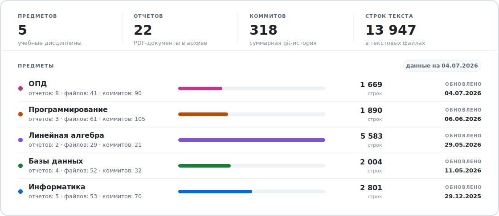
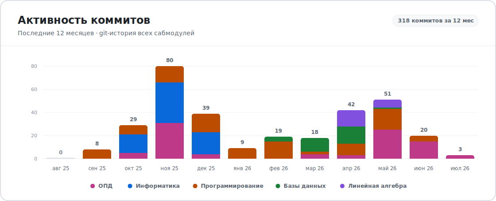

# Архив лабораторных ИТМО CSE

Лабораторные работы и другие материалы по направлению 09.03.04 «Программная инженерия» в Университете ИТМО.

> [!WARNING]
> Использование материалов целиком или частично без ссылки на автора является нарушением академической этики.
> 
> Выдача чужого решения за собственное считается плагиатом. За это в ИТМО могут применяться серьезные академические санкции, вплоть до отчисления.
> 
> Используйте материалы как справочный источник, а не как готовую замену самостоятельной работе.

## Структура материалов
> [!NOTE]
> Требования преподавателей, формулировки заданий и критерии оценивания могут меняться со временем. Некоторые решения в репозитории могут отличаться от актуальных требований.
>
> В лабораторных работах также могут встречаться неточности или незначительные ошибки, поэтому лучше использовать этот репозиторий как ориентир и выполнять задания самостоятельно.

<!-- archive-structure:start -->
### 1-й курс

| Семестр | Предмет | Папка | Стек |
| --- | --- | --- | --- |
| 1 | Информатика | [`informatics/`](1_course/informatics/) |   |
| 1-2 | Линейная алгебра | [`linear-algebra/`](1_course/linear-algebra/) |   |
| 1-2 | Основы профессиональной деятельности | [`bpa/`](1_course/bpa/) |   |
| 1-2 | Программирование | [`programming/`](1_course/programming/) |  |
| 2 | Базы данных | [`databases/`](1_course/databases/) |  |
<!-- archive-structure:end -->

## Пульс архива

<!-- archive-pulse:start -->
<picture>
  <source media="(prefers-color-scheme: dark)" srcset="assets/readme/archive-overview-dark.svg">
  
</picture>

<picture>
  <source media="(prefers-color-scheme: dark)" srcset="assets/readme/archive-activity-dark.svg">
  
</picture>
<!-- archive-pulse:end -->

## Контакты

- **Автор**: Михальченков Александр
- **Telegram**: [@mikhalexandr](https://t.me/mikhalexandr)
- **GitHub**: [mikhalexandr](https://github.com/mikhalexandr)
